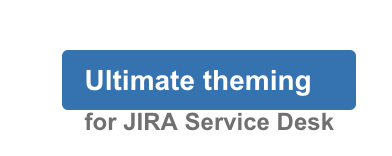
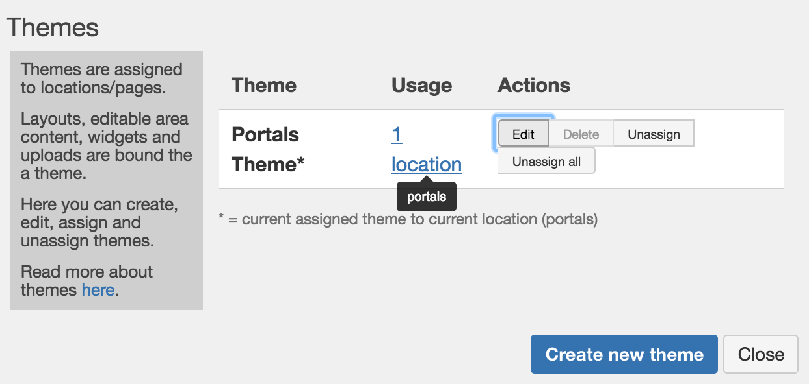
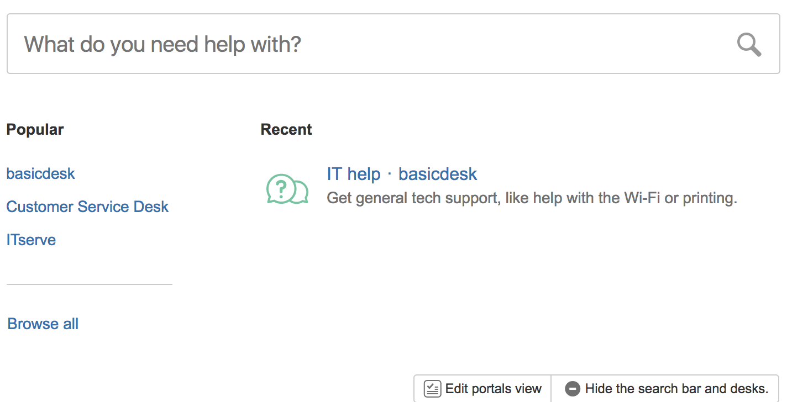
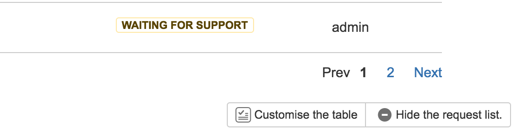

# Ultimate Theming for Jira Service Desk

## Introduction

This is the documentation and help page for the new version 2.X of the Ultimate Theming for Jira Service Desk.

You can find the old documentation for v.1.X [here](https://pronto-plugins.herokuapp.com/ultimate.html).

## What changed from version 1 to version 2

* Added better icons to edit editable areas and widgets
* Added the option to customize login page
* Added the option to export to CSV from "My requests".
* Made the request view of a portal isolated, meaning that a theme can be applied to the "request types" view of a portal, and another theme can be applied to the "request view" of a portal.
* A new structure for the server side, meaning the themes from v1 is going to be migrated into a new format going forward. You should only notice some visual changes to modal windows and so on if updating the plugin.
* New users must create a theme and assign it to a portal page, before any customization can be made. A layout must be added to the theme as well, if one wants to change the structure of a portal page.
* Removed the feature of hiding request types. This is not necessary anymore, since it's possible in Service Desk natively.


More features are to be added soon.

## Features

* IN APP editor, which means live editing by Administrator in the Service Desk.
* Create/edit/apply themes. A theme is applied to Service Desk location, e.g. the Portals page, a specific desk/portal, the user profile and so on. A theme consist of layout, custom HTML, uploaded files and changes to UI components.
* Create/edit/apply layouts to themes: insert custom HTML in layout areas using a rich text editor, link to uploaded files, and insert images.
*Upload files - for a theme. Javascript and CSS are automatically loaded when a theme loads. Events in your javascript can be triggered on location change!
* Edit (and hide) different components in the Service Desk:
* Create a category view of portals that replaces the normal portals view.
* Add fields to the “My Requests” form, e.g. Created/Updated/Labels and more (Order them as well).
* Sort fields on the My Requests form (ascending/descending). This only works for the current shown requests, but we are working on a better solution.
* Theme login pages.
* Export to CSV from "My requests".

## Installation

Installation in Jira is through Atlassian Marketplace, or by downloading a version and uploading into the Addons section of Jira. 

## Usage and how do I get started

1. As as administrator (or Sysadmin) go to the portals.
2. Click the "Ultimate themning" button in the bottom right corner. A left side menu bar should show up.



Now, to do anything, please go read themes and understand the concept. Everything you do on a page is bound to a theme!

3. Create and assign a theme to the page you want to theme. 



Note that if you share a theme between pages/locations (e.g. different portals), then they will look and behave the same (except for of course the normal Service Desk content).

In the screenshot above, a theme called "Portals Theme" was created. This could be assigned to the Portals page, and only used there. If you e.g. want some generic theme for all the individial portal pages, you create a new theme (e.g. called Portal Standard Theme) and assign to all portals.

4. Now we have assigned a theme, you can customize the portals. Find the button "Edit portals view" under the list of portals, and click it:



5. Now you can set up a categories view of portals if you want, instead of using the normal way.

Simple as that! 

**Now let's say you to add some new fields to the My Requests**.

1. Go to "My Requests".

2. Create and assign a theme to the page. E.g. create a new theme called "My Requests Theme".

3. A button now shows up under the list of requests. Click it.



4. You can now add more fields. And order them around as well. You can also enable CSV export.


## Explanation

### Themes

<a name="themes"></a>

The plugin is theme based, which means that every Service Desk page is under a theme. **By default all pages have no theme assigned.**

All customizations you make (except changing the global footer) are **bound to a theme**. This means themes can be re-used all over the portal. This also means you can have **different views on different portal pages** - maybe you need to print guidelines on one portal, and show some links on another. Theming lets you do that.

Uploads are only usable on pages for the theme they are uploaded to. For instance, .cs/.js files, will only be rendered to the specific theme on the pages the theme is assigned.

### Layouts

<a name="layout"></a>

A layout defines the structure of the page. 

**When no layout is assigned to the theme of the current portal page, the layout is just Service Desk "as is".**

By creating and assigning a layout, you can have top/bottom/sidebars/custom areas for inserting your own HTML.

The HTML is edited in raw source code. So make sure write valid HTML. E.g. put it through a HTML validator before using it.

Layouts can be created in the modal window for managing layouts. Just click the button next to "Layouts:" in the menu bar. Remember, you have to assign a theme first (as layouts are bound to them). You can also edit, copy or delete layouts. Clicking the assign button next to a layout, assigns the layout to the current theme. 

Layouts can have editable areas. By creating those, you can click the pencil icon at the area (when the layout is set on the theme) and use a simple WYSIWYG HTML editor to add content, like uploaded images etc.

Editable areas are created using the macro **${editable}** in the HTML. This creates a wrapping div when rendered.

The plugin layout system has support for the Bootstrap Grid system, which you can read about here: https://getbootstrap.com/examples/grid/.

If you need e.g. a response left sidebar (+ top and bottom), you can use the following HTML for your layout. We do not recommend that you use a **right sidebar** since the Service Desk main content seems often to have a fixed width of 700px (and thus not responsive).

```
 <div style="margin-top:0" class='container-fluid'>
    <div class='row'>
        <pre>
        <div class='col-md-12 col-xs-12' style='min-height:80px'>
            ${editable}
        </div>
    </div>
    <div class='row'>
        <div class='col-md-3 col-xs-12'>
            ${editable}
        </div>
        <div class='col-md-9 col-xs-12'>
            <div style='float:left'>
            ${service-desk-content}
            </div>
            <div style='clear:left' />
        </div>
    </div>
    <div class='row'>
        <div class='col-md-12 col-xs-12' style='min-height:80px'>
            ${editable}
        </div>
    </div>
 </div>
```

### Uploads (JS, CSS and files)

<a name="uploads"></a>

The .css files you upload are automatically inserted and rendered on the page.

The .js files are also inserted on the page and executed (but only once, on page load). Note that to get the event that the location changes, use the following javascript as a template, which essentially creates an event listener (the function SERVICEDESK_REGISTER_JAVASCRIPT is made possible using the addon):

```
(function(){
    SERVICEDESK_REGISTER_JAVASCRIPT( {
        onLocationChange: function(location) {
            console.log("onLocationChange",location) // inspect the location
        }
    } )
}())
```

Note that **jQuery** is available in scripts by the variable AJS.$, or jQuery. It depends on the Service Desk version. Just trial and error here for you.

When creating javascript, please wrap your code into a try catch(err) construction, so to avoid errors that can make an effect on the whole application.

A file uploaded can be linked to in the HTML editor (editable area) by using the "link" button/feature (toolbar). If using the source editor, use the following syntax to create a link to a file: 
```
<a href="${file:filename.pdf}">Link texta</a>.
```

### A note on editable areas

Editable areas in layouts can be difficult to comprehend.

A layout consists of static HTML. There you can define HTML which always is shown when using the layout. But, you can also create an editable area inside a layout. This creates some dynamic to the layout.

The content of the editable area is now bound to the theme (which you edit on the page). E.g. one theme has "some text" in the top editable area, another theme has "another text piece" in the top editable area, where the two themes share the same layout.

So it means you can use the layout multiple places, like e.g. a sidebar added layout can be used multiple places. But the actual content is added on the themes. And thus on the locations that use the theme.

### Widgets

#### Portal categories

The addon lets you create another view of portals, namely that portals are shown divided into categories you define.

1. Go to the portals page (the base page)
2. Click Edit portals view
3. Enable categories
4. Set categories portals. 

You can also hide categories, and disable the search functionality.

#### Fields to My requests

The addon lets you add additional fields as columns to the table on the "My/All requests" page:
 1. Go to e.g. My requests
 2. Click "Customise the table" (beneath the table). A modal opens.
 3. Add the fields. Fields can be moved up and down. This will be reflected in the list.
 
You can not change the order of the standard fields.

Note that if you find a that a specific field does not exist in the list, please contact us at prontoplugins@gmail.com. We will add the field (actual the field type) if possible.

#### Export to CSV

In the modal for "Customise the table", you can also enable export to CSV. When enabled, a button for this shows up right under the request list.

#### Edit login pages

The addon features that you can edit login pages as well, both the global login page, but also the individal portal login pages.

How: 
1. Go to the portals page or a specific portal page. 
2. A link shows up under the "Manage" (uploads) button, that says something like "Edit login page for..".
3. Click the link. You can now set a theme on the login page and so forth.
4. When done, sign in.

